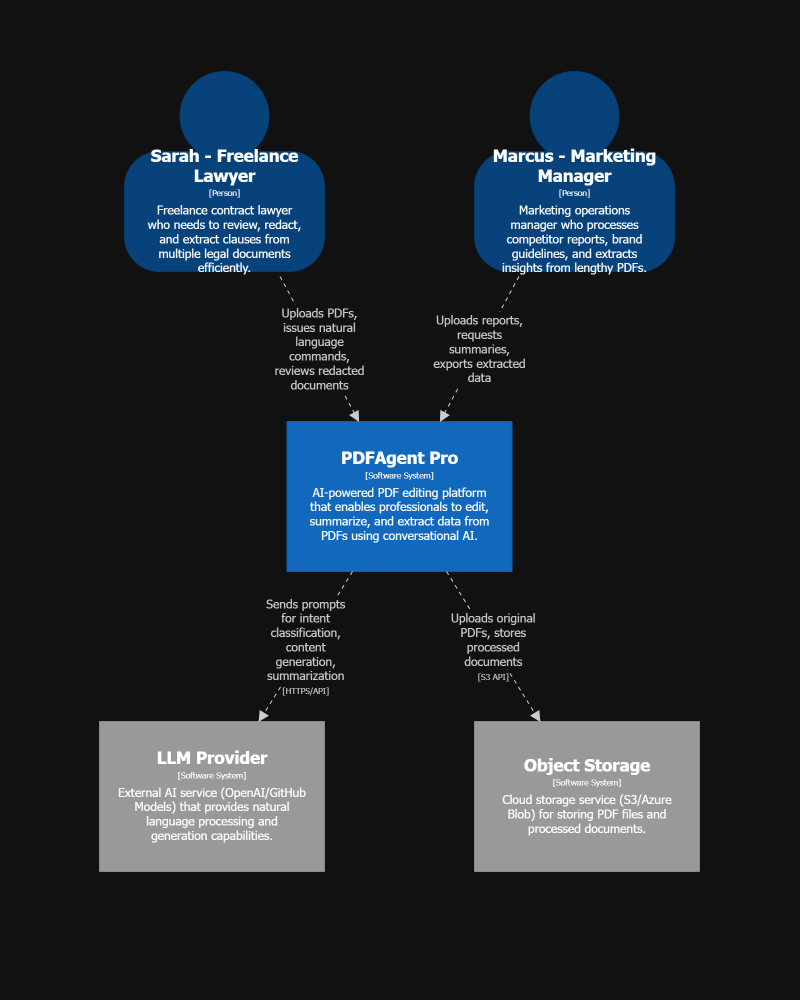
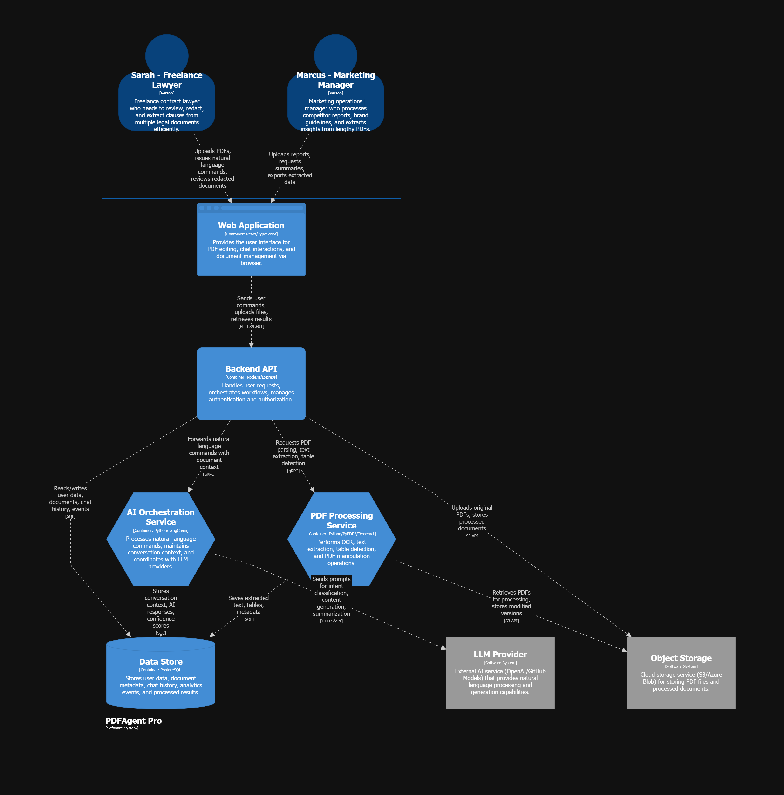
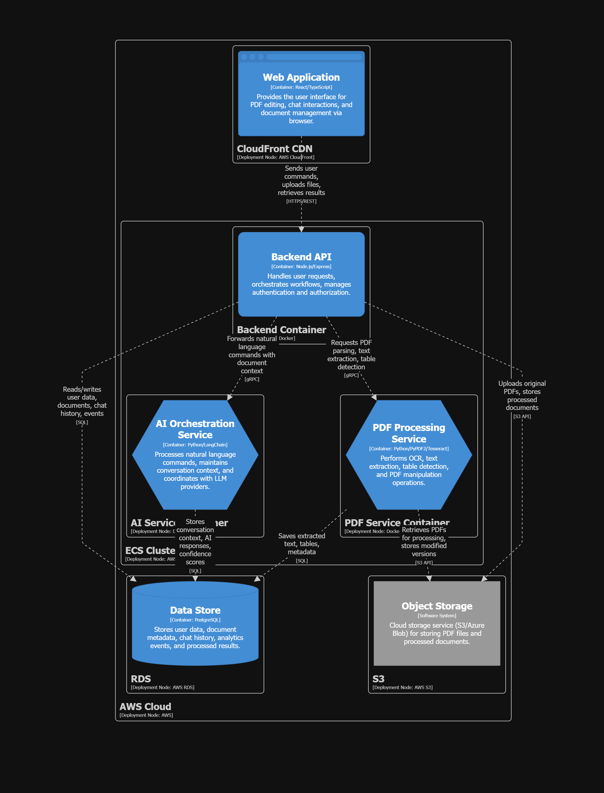

# PDFAgent Pro: AI-Powered PDF Editor

**Author**: Idode Destiny M  
**Project Type**: AI Product Management Portfolio  
**Last Updated**: November 30, 2025

## Product Vision
PDFAgent Pro revolutionizes PDF workflows for busy professionals who waste hours on repetitive document tasks. Unlike expensive traditional editors that require manual effort, we combine conversational AI agents with intelligent automation to deliver instant document editing, summarization, and extraction. Success is measured by reducing document processing time by 70% while maintaining 95%+ accuracy, democratizing enterprise-grade PDF capabilities at a fraction of the cost.

## Target Users

### 1. Freelance Legal Professionals
- **Persona**: Solo lawyers, paralegals, contract consultants
- **Pain Points**:
  - Spend 10-15 hours/week manually reviewing and redacting contracts
  - Adobe Acrobat costs £19.97/month but still requires manual editing
  - Need to extract specific clauses from multiple documents quickly
  - Struggle with inconsistent formatting across client documents

### 2. Marketing & Content Managers
- **Persona**: Digital marketers, content strategists, brand managers
- **Pain Points**:
  - Process 20-30 brand guidelines, reports, and proposals weekly
  - Current tools (Smallpdf, Adobe) lack AI-powered content extraction
  - Waste time reformatting PDFs for presentations and social media
  - Cannot easily compare competitor documents or extract insights

## MVP Features (Top 3)

1. **Conversational AI Editor**
   - Natural language commands: "Remove all watermarks" or "Extract pricing tables"
   - Context-aware editing that understands document structure
   - Multi-step workflows in a single prompt

2. **Intelligent Document Summarization**
   - Generate executive summaries from 100+ page documents in seconds
   - Extract key clauses, dates, and action items automatically
   - Custom summary formats (bullet points, paragraphs, tables)

3. **AI-Powered Batch Extraction**
   - Process multiple PDFs simultaneously
   - Extract structured data (tables, forms, signatures)
   - Export to Excel, CSV, or JSON with one click

## Success Metrics

- **Edit Accuracy**: >95% success rate on user commands (measured via user feedback)
- **Time-to-Value**: User completes first successful edit in <2 minutes from signup
- **Processing Speed**: Summarize 50-page document in <30 seconds
- **User Retention**: 60% weekly active users after 30 days
- **Cost Efficiency**: 50% lower price than Adobe Acrobat with equivalent features

## Competitive Landscape

| Tool | Strengths | Weaknesses | Our Edge |
|------|-----------|------------|----------|
| **Adobe Acrobat** | Industry standard, comprehensive features | Expensive (£19.97/mo), bloated UI, slow performance, limited AI (1000 requests/month cap) | Unlimited AI agent interactions, 3x faster, 60% cheaper |
| **Smallpdf** | Simple interface, affordable | Basic AI features, unreliable billing, slow processing, limited free tier | Advanced AI workflows, transparent pricing, batch processing |
| **LightPDF** | Budget-friendly, cloud-based | Poor customer service, 20MB file limits, inconsistent AI results, hidden restrictions | No file size caps, reliable AI, responsive support |
| **PDFgear/Foxit** | Free/cheap options | Limited AI capabilities, manual processes | Full AI automation, conversational interface |

## Market Validation Insights

### Top 3 User Pain Points (from competitor reviews):

1. **Cost vs Value Imbalance**
   - Adobe charges premium prices but users report slow performance and bloated features
   - Smallpdf and LightPDF have hidden fees and surprise subscription charges
   - Users want powerful AI features without enterprise-level costs

2. **AI Limitations & Reliability**
   - Adobe AI Assistant has strict usage caps (1000 requests/month) and throttling
   - LightPDF AI often fails or ignores user requests without explanation
   - Smallpdf AI is too basic for professional workflows

3. **Poor User Experience**
   - Adobe: 30-second startup delays, unintuitive interface, excessive clicks
   - Smallpdf: Locked features until payment, no file saving without signup
   - LightPDF: Undisclosed file size limits, poor customer support

### AI Gaps in Current Market:

- **No True Conversational Agents**: Competitors offer basic Q&A, not full workflow automation
- **Single Document Focus**: Can't intelligently compare or process multiple PDFs simultaneously
- **Limited Context Understanding**: AI doesn't understand document purpose (contract vs report vs form)
- **No Collaborative AI**: Missing features for team workflows with AI assistance

### Our Key Differentiator:

**Agent-Powered Workflow Orchestration** - Unlike competitors' simple chatbots, PDFAgent Pro uses specialized AI agents that understand context, remember user preferences, and execute complex multi-step workflows through natural conversation. Think "ChatGPT for PDFs" versus "FAQ bot."

## User Personas (Detailed)

### Persona 1: Sarah Chen - Freelance Contract Lawyer

**Demographics**:
- Age: 34
- Location: Manchester, UK
- Experience: 8 years in corporate law, went freelance 2 years ago
- Tech Proficiency: Moderate (uses basic software confidently)

**Goals**:
- Review 15-20 contracts per week efficiently
- Redact sensitive information quickly and accurately
- Extract key terms (deadlines, payment terms, liabilities) automatically
- Maintain professional document quality for clients

**Frustrations**:
- Adobe Acrobat subscription costs £240/year but still requires manual work
- Searching for specific clauses across multiple documents takes hours
- Formatting inconsistencies when clients send poorly scanned PDFs
- Risk of missing critical details when manually reviewing long contracts

**Weekly PDF Tasks** (12-15 hours/week):
- Monday: Redact 3-5 employment contracts (2 hours)
- Tuesday-Thursday: Extract terms from supplier agreements for comparison (4 hours)
- Wednesday: Create summaries of lease agreements for clients (3 hours)
- Friday: Compile evidence documents, merge PDFs for case files (2 hours)
- Weekend: Review and annotate partnership agreements (2 hours)

**Desired Outcome**: Cut document processing time by 50% (save 6-7 hours/week) while improving accuracy and reducing subscription costs.

---

### Persona 2: Marcus Rodriguez - Marketing Operations Manager

**Demographics**:
- Age: 29
- Location: London, UK
- Role: Marketing Ops at mid-sized SaaS company (50 employees)
- Tech Proficiency: High (comfortable with multiple tools and platforms)

**Goals**:
- Process competitor reports and whitepapers to extract market insights
- Convert brand guidelines and reports into shareable formats quickly
- Create engaging content snippets from lengthy industry documents
- Maintain organized repository of marketing collateral

**Frustrations**:
- Smallpdf free tier limits him to 2 tasks/day, paid plan (£9/month) still lacks features
- Manually copying tables and charts from PDFs breaks formatting
- No easy way to compare competitor positioning documents
- Wastes time reformatting PDF content for presentations and social posts

**Weekly PDF Tasks** (8-10 hours/week):
- Monday: Extract data from weekend industry reports (2 hours)
- Tuesday: Convert customer case studies to social media graphics (1.5 hours)
- Wednesday: Summarize competitor whitepapers for team briefings (2 hours)
- Thursday: Compile and format quarterly marketing reports (2 hours)
- Friday: Update brand guideline PDFs with new assets (1.5 hours)
- Ad-hoc: Process event materials, vendor proposals, analytics reports (varies)

**Desired Outcome**: Automate 60-70% of PDF processing tasks, extract insights 5x faster, and eliminate subscription to multiple tools (currently pays for Smallpdf + Canva + Adobe Scan).

---

## Architecture Overview

PDFAgent Pro follows a microservices architecture with specialized services for AI orchestration, PDF processing, and data management. The system is designed for scalability, maintainability, and clear separation of concerns.

### System Context

The high-level system context shows how users (Sarah and Marcus) interact with PDFAgent Pro, and how the system integrates with external services like LLM providers and object storage.

### Container Architecture

The container diagram details the internal architecture with five key components:

- **Web Application** (React/TypeScript): Browser-based UI for PDF editing and conversational interactions
- **Backend API** (Node.js/Express): Orchestrates workflows, manages auth, coordinates services
- **AI Orchestration Service** (Python/LangChain): Processes natural language, maintains context, coordinates with LLMs
- **PDF Processing Service** (Python/PyPDF2/Tesseract): Handles OCR, text extraction, table detection
- **Data Store** (PostgreSQL): Stores user data, documents, chat history, analytics events

### Deployment Architecture

Production deployment on AWS leverages CloudFront CDN for the web app, ECS for containerized services, RDS for the database, and S3 for object storage.

**Architecture as Code**: All diagrams are generated from [Structurizr DSL](docs/architecture/workspace.dsl) following the C4 model.
## Live Demo

🚀 **[View Live Application](https://pdfagent-pro.vercel.app)**

The application is deployed on Vercel and available for testing. Local development uses SQLite via Prisma; the architecture is designed for 

## Getting Started

*This repository will contain the product roadmap, technical architecture, and development milestones for PDFAgent Pro.*

**Status**: Product Planning Phase  
**Next Steps**: Technical feasibility study, MVP prototype development

## License

MIT License - See LICENSE file for details
